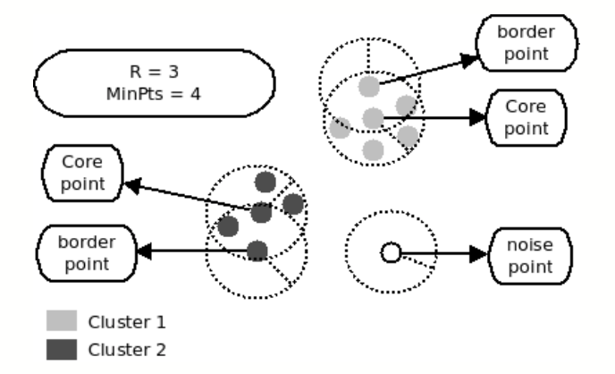
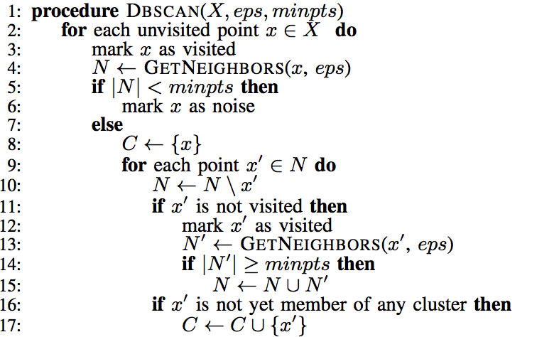
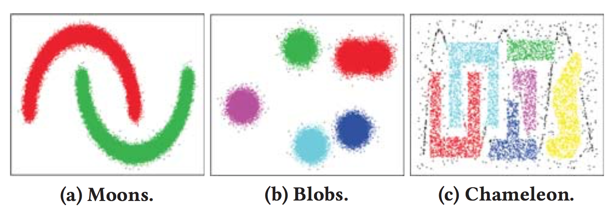

## Summary

We are going to implement and optimize a density-based clustering algorithm [dbscan] on both GPU (CUDA) and distributed memory (MPI), and perform a detailed analysis and comparison on various datasets.

## Background

DBSCAN is a density-based clustering algorithm. Each object is either `core`, `border` or `noise` as shown in the graph below. The algorithm has two parameters, `R` the proximity radius, and `MinPts` the minimum number of neighbors. For any given object `o`, we define all objects that are at most `R` distance (Euclidean) away its `neightbors`. If a given objects has more `neighbors` than `MinPts`, then it is defined as `core` and all objects reachable directly or indirectly from it is defined as `border` and they are within the same cluster. If the object is not reachable from any `core`, then it is defined as `noise`. 

Below is the pseudo-code for DBSCAN:

This problem could be benefitting from parallelism in the following ways:

* The process of finding the `neighbors` (`GetNeighbors`) for each object could benefit from parallelism
* The process of traversing all the objects within a cluster could benfit from parallelism

There have been many efforts parallelizing the algorithm after the seminal paper [DBSCAN], like [G-DBSCAN], [MR-DBSCAN], [RP-DBSCAN], etc. However, we notice that these algorithms either still have some space for parallelism or cache optimization or are designed for Map-Reduce. Therefore, in this project, we will be focusing on a graph-based implementation using GPU and MPI by borrowing some key ideas from these papers while exploit parallelism/cache optimization opportunities that might be missing from these papers. 

## Challenge
Parallelization is not trivial for clustering algorithm since it exhibits inherent sequential data access order, namely, the cluster is expanded in BFS manner, so that points at higher level cannot be explored until the lower level points are exhausted. Although there is no dependency for points at the same level, level synchronization is still required and limit the performance. We’ll explore the work around method in this project.

Large graph can not fit into cache/memory, so we should try to avoid random access as much as possible. We plan to restructure graph data structure so that most data access is contiguous or reusable. We will also explore graph compression and other techniques.

 Work balance requires special attention as well, especially in skewed data set where cluster size diverse a lot.

Shared memory is essential in many parallel clustering algorithm, how to adapt these algorithm for cluster of machines without heavy communication overhead is also a challenge.

## Resources
We will use both GHC machines and Lateday clusters.

We will use [G-DBSCAN] as our starting point and implement the algorithm from scratch before optimizing it.

For the purpose of performance analysis, we will use the datasets (100, 000 points each) applied by the original DBSCAN paper as shown in the graph below. 

We will also use real-life datasets such as OpenStreetMap (GPS data), Cosmo50 (N-body simulation data), and TeraClickLog (click log data).

## Goals and Deliverables
Must achieve: optimize existing parallel DBSCAN with CUDA on single GHC machine (expected speedup by 50x over sequential version, and 5x over other parallel implementation).

Plan to achieve: reduce communication cost and adapted the algorithm to distributed memory machines with MPI.

Hope to achieve: experiments on different datasets especially extremely large one that can not be fit in memory.

What to demonstrate: this project is more research oriented instead of application oriented, so there won’t be an interactive demo. We are able to show the clustering results on real-life datasets such as OpenStreetMap and Cosmo50. We’ll also show performance analysis graphs including speedup, time breakdown, load balance, scalability to the number of thread/nodes, and memory footprint. 

Another aspect we could learn from this project: as some of the papers we will be looking at are written in map-reduce, we could look at the pros and cons of map-reduce programming model versus message passing/data parallel model which we will be using.

## Platform choice
The algorithm G-DBSCAN we chose as a starting point is targeting for GPU, so it’s better if we do optimization on the same platform for performance comparison. However, the size of dataset has been growing rapidly in real life, so that a single machine can not meet the requirement in most cases. So it’s meaningful and necessary to be able to efficiently run clustering algorithm on distributed machines. That’s why we also plan to adapt the algorithm for message passing model running on a cluster of machines. 

## Schedule

| Week| Goal| Detail|
|-----|-----|-------|
| Week 1(10/29-11/05) | Research | Write proposal, read related paper and implement sequential version. |
| Week 2(11/05-11/12) | 1st Parallel Implementation        | Implement G-DBSCAN with CUDA and do analysis.                        |
| Week 3(11/12-11/19) | Optimization (Checkpoint!)         | Conduct optimization and write checkpoint report.                    |
| Week 4(11/19-11/26) | MPI Version                        | Improve and implement MPI version running on cluster.                |
| Week 5(11/26-12/03) | Performance analysis               | Run experiments on different datasets and draw graphs.               |
| Week 6(12/03-12/10) | Wrap up (Final report and poster!) | Run more experiments and prepare final report and poster.            |

## References

[dbscan]: https://www.aaai.org/Papers/KDD/1996/KDD96-037.pdf

\[1\] Ester, M., Kriegel, H.P., Sander, J. and Xu, X., 1996, August. A density-based algorithm for discovering clusters in large spatial databases with noise. In Kdd (Vol. 96, No. 34, pp. 226-231).

[g-dbscan]: https://www.sciencedirect.com/science/article/pii/S1877050913003438
\[2\] Andrade, G., Ramos, G., Madeira, D., Sachetto, R., Ferreira, R. and Rocha, L., 2013. G-dbscan: A gpu accelerated algorithm for density-based clustering. Procedia Computer Science, 18, pp.369-378.

[pds-dbscan]: https://ieeexplore.ieee.org/document/6468492
\[3\] Patwary, M.A., Palsetia, D., Agrawal, A., Liao, W.K., Manne, F. and Choudhary, A., 2012, November. A new scalable parallel DBSCAN algorithm using the disjoint-set data structure. In Proceedings of the International Conference on High Performance Computing, Networking, Storage and Analysis (p. 62). IEEE Computer Society Press.

[mr-dbscan]: https://ieeexplore.ieee.org/document/6121313
\[4\] He, Y., Tan, H., Luo, W., Mao, H., Ma, D., Feng, S. and Fan, J., 2011, December. Mr-dbscan: an efficient parallel density-based clustering algorithm using mapreduce. In 2011 IEEE 17th International Conference on Parallel and Distributed Systems (pp. 473-480). IEEE.

[ng-dbscan]: http://www.vldb.org/pvldb/vol10/p157-lulli.pdf
\[5\] Lulli, A., Dell'Amico, M., Michiardi, P. and Ricci, L., 2016. NG-DBSCAN: scalable density-based clustering for arbitrary data. Proceedings of the VLDB Endowment, 10(3), pp.157-168.

[rp-dbscan]: https://dm.kaist.ac.kr/lab/papers/sigmod18.pdf
\[6\]Song, H. and Lee, J.G., 2018, May. RP-DBSCAN: A superfast parallel DBSCAN algorithm based on random partitioning. In Proceedings of the 2018 International Conference on Management of Data (pp. 1173-1187). ACM.
