# Final Report(Dec.9th)
[Link to the project page](https://celsius38.github.io/15618_project/)

## Summary
In this project we explore different methods including CUDA and MPI to speed up a well-known clustering algorithm: dbscan. We started from the a very basic `c++` sequential version and gradually make our way to more complex and more advanced algorithms such as [G-DBSCAN] and [RP-DBSCAN]. We also try to optimize the part where these algorithms are relatively inefficient and try to adapt the original map-reduce pattern to MPI. We compare our methods against `sklearn.cluster.DBSCAN` in terms of efficiency, and discuss which algorithm is more preferable under different hyper-parameter settings.

## Background
### Introduction to DBSCAN
`DBSCAN` is a non-parametric density-based clustering algorithm (typically) on Euclidean space. It works by finding the number of connected parts (a.k.a. number of islands) on a graph where vertices are points and (directed) edges are non-symmetric reachability defined as following:
$$Neighbor_p = \{q: dist(p,q) \leq \epsilon \}$$
$$isCore(p) = \left \vert Neighbor_p \right \vert \geq N  $$
$$p \rightarrow q \text{ if } isCore(p) \land dist(p, q) \leq \epsilon $$
where $dist$ is a distance function (e.g.: Euclidean distance), hyper-parameter $\epsilon$ is the maximum distance for two points to be classified as neighbors, and hyper-parameter $N$ is the minimum number of neighbors for a point to be classified as *core point*. In the end, every point will either has a `cluster_id` or `-1` as noise. For simplicity and demo purpose, we will only be dealing with two-dimensional points in the project.

The following figure consisting 100,000 points (also one of our test-cases): 

Therer are 3 classes for the specific hyper-parameter we are using, one blue, one green and one red, and the rest transparent grey ones are noise.


Typically, the algorithm has two major steps:   

* Graph construction:
	* In this step, we find all neighbors for every point, and also classify each point as either *core* or *non-core* point based on the number of neighbors it has. 
* BFS/DFS:
	* In this step, we start with any point that is not yet classified and is a core point and do either a breadth-first search or a depth-first search and stop until we reach a *non-core* point or a point of another cluster.

Naively implemented, the first step has a complexity of $O(n^2)$ as we have to inspect the distance of every pari of point. Then the second step has a complexity of $O(V + E)$ for either BFS or DFS.


### DBSCAN break-down
First of all, we notice that the first step is a very typical *N-body problem*, where given a point we want to find all points within radius of $\epsilon$, and the key idea is to either use some tree structures to partition the space and eliminate sub-spaces too far away from the point of interest. This we actually have seen in *Assignment 3* and *Assignment 4*, and in addition to *quad-tree*, we could also use *k-d tree*, which is a little bit more involved but the ideas are the same. Since we have done *quad-tree* before, we decided to take the *data-parallel* approach introduced in *Lecture 7* but we have never actually implemented. Also, this part is exactly where the original [G-DBSCAN] algorithm is lacking and we hope to see a performance boost from `data-parallel`.

The graph construction part could also be parallelized by distributing the work to different workers through MPI. Each `worker` would only be constructing a subset of all points and `master` will collect the result and merge all different sub-graphs constructed by each `worker`. This is actually more invovled and we will actually be constructing the graph on cells instead of on points and we will defer the discussion until we introduce [RP-DBSCAN]

The second step could also be parallelized by level-synchronized BFS. We process the initial  core point(`level 0`), and mark all its neighbors to be visited in the next round(`level 1`). Everytime we visit `level N` and mark all points to be visited at `level N + 1` and we stop if no points are marked at the currect level. We paralleize over point where each thread would check its point need to be visited this round. We synchronize at every level (launch kernel for every level)


## Implementations
### G-DBSCAN
For `G-DBSCAN` we use CUDA. As a starting point, we implement the original algorithm as described in [G-DBSCAN].

#### Graph construction:
```[c++]
__device__ distance(float2 p1, float2 p2){...}

__global__ void
degree_kernel(...) {
	int v = blockIdx.x * blockDim.x + threadIdx.x;
	if ( v >= num_points) return;
	size_t degree = 0;
	float2 p1 = ((float2*)(points))[v];
	for(size_t i = 0; i < num_points; ++i){
		float2 p2 = ((float2*)(points))[i];
		if(distance(p1, p2) <= eps){
			++degree;
    	}
	}
	point_degree[v] = degree;
}

```
To speed up the loading, we convert the point to `float2` and load one `float2` at a time from the `points`. Also, to prevent copying back and forth between `host` and `device`, we try to keep all data all `device`, and also specifying the execution policy of `thrust` to be `thrust::device`.

After we have the degree of each vertex, we could then do a `thrust::exlusive_scan` to get the start index in the adjacency list for each of the point. We then scan again to fill in the adjacency list.

```
__global__ void
adj_list_kernel()
{
	int v = blockIdx.x * blockDim.x + threadIdx.x;
	if( v >= num_points) return;
	size_t cur_index = vertex_start_index[v];
	float2 p1 = ((float2*)points)[v];
	for(size_t i = 0; i < N; i++) {
		float2 p2 = ((float2*)points)[i];
		if(distance(p1,p2) <= eps){
			adj_list[cur_index] = i;
			cur_index++;
		}
	}
}

...	thrust::exclusive_scan(thrust::device, device_degree, device_degree + num_points, device_start_index);

```

#### BFS:

In this stage, we have a 0/1 vector `border` indicating whether we should visit every point at current level, and we keep looping until `border.isEmpty()`

```[c++]
__global__ void
bfs_kernel(size_t* boarder, int* labels, int cluster_id) {
	int j = blockIdx.x * blockDim.x + threadIdx.x;
	if (j < cuConstParams.N) {
	if(!border[j]) return;
	border[j] = 0;
	labels[j] = cluster_id;
	// we reach a non-core point
	if(cuConstParams.vertex_degree[j] < cuConstParams.minPts) return;
	size_t start_index = cuConstParams.vertex_start_index[j];
	size_t end_index = start_index + cuConstParams.vertex_degree[j];
	for(size_t neighbor_index = start_index; neighbor_index < end_index; neighbor_index++) {
		size_t neighbor = cuConstParams.adj_list[neighbor_index];
		if(labels[neighbor] <= 0) { // either previously marked as noise or not yet visited
			border[neighbor] = 1;
		}
	}
}
```

### G-DBSCAN Data Parallel

#### Graph construction:
In G-DBSCAN Data Parallel implementation, we use data-parallel approach introduced in *Lecture 7*. So basically each point will be in exactly one bin where the side length of each bin is $\epsilon$

Using the following example from lecture:


- First we parallel over point and assign each point to a unique cell:

| particle index | 0 | 1 | 2 | 3 | 4 | 5 |
|----------------|---|---|---|---|---|---|
| cell index     | 9 | 6 | 6 | 4 | 6 | 4 |
```[c++]
__global__ void
binning_kernel()
{
    int v = blockIdx.x * blockDim.x + threadIdx.x;
    if(v >= cuConstParams.num_points) return;
    float2 point = ((float2*)(cuConstParams.points))[v];
    float side = cuConstParams.side;
    int col_idx = (point.x - cuConstParams.min_x)/side;
    int row_idx = (point.y - cuConstParams.min_y)/side;
    cuConstParams.bin_index[v] = row_idx * cuConstParams.col_bins + col_idx;
    cuConstParams.point_index[v] = v;
}

```

- Then we sort particle index by cell index, which is implemented in `thrust` as `thrust::sort_by_key`:


| particle index | 3 | 5 | 1 | 2 | 4 | 0 |
|----------------|---|---|---|---|---|---|
| cell index     | 4 | 4 | 6 | 6 | 6 | 9 |

\
Now that the `cell index` will be increasing order and `particle index` has the original pairing with `cell index`. 

- The third step, we compute the start and end index for each of the cell in the particle - cell index table, so that we could easily find all point indices in a given cell:


| cell id     | 0 | 1 | 2 | 3 | 4 | 5 | 6 | 7 | 8 | 9 |
|-------------|---|---|---|---|---|---|---|---|---|---|
| cell starts | 0 | 0 | 0 | 0 | 0 | 0 | 2 | 0 | 0 | 5 |
| cell ends   | 0 | 0 | 0 | 0 | 2 | 0 | 5 | 0 | 0 | 6 |

```
__global__ void
find_bin_start_kernel()
{
    int v = blockIdx.x * blockDim.x + threadIdx.x;
    if(v >= cuConstParams.num_points) return;
    int bin_idx = cuConstParams.bin_index[v];
    // first cell
    if(v == 0){ 
        cuConstParams.bin_start_index[bin_idx] = 0;
    }
    // mark start of a new cell and end of last cell
    else{ 
        int last_bin_idx = cuConstParams.bin_index[v-1];
        if(bin_idx != last_bin_idx){
            cuConstParams.bin_start_index[bin_idx] = v;
            cuConstParams.bin_end_index[last_bin_idx] = v;
        }
    }
    // last cell
    if(v == cuConstParams.num_points - 1){ 
        cuConstParams.bin_end_index[bin_idx] = cuConstParams.num_points;
    }
}

```

Then similar as before, we calculate the degree for each point, but now since we know that the side length of each bin is $\epsilon$, for any point $p$ in a specific cell, its neighbors could only possibly be in the 8 sorrounding cells.

```
__device__ size_t
degree_in_bin(float2 p1, int neighbor_bin_id)

__global__ void
degree_kernel(){
	int v = blockIdx.x * blockDim.x + threadIdx.x;
	if (v >= cuConstParams.num_points) return; 
	size_t pid = cuConstParams.point_index[v];
	float2 p1 = ((float2*)(cuConstParams.points))[pid];
	int bin_idx = cuConstParams.bin_index[v];
	size_t degree = 0;
	for(int neighbor_bin_id ...){
    	degree += degree_in_bin(p1, neighbor_bin_id);
	}
    cuConstParams.degree[pid] = degree;
}
```

| point id | 0 | 1 | 2 | 3 | 4 | 5 | 
|----------|---|---|---|---|---|---|
| degree   | 1 | 3 | 3 | 2 | 3 | 2 |

Then `thrust::exclusive_scan` to get the `start_index` in the `adj_list` for each point:


| point id | 0 | 1 | 2 | 3 | 4 | 5  |
|----------|---|---|---|---|---|----|
| start index| 0 | 1 | 4 | 7 | 9 | 12 |


And finally, we scan for each point its neighbors in surrounding cells again to get the final `adj_list`:


| point id  | 0 | 1 |   |   | 2 |   |   | 3 |   | 4 |   |   | 5 |
|-----------|---|---|---|---|---|---|---|---|---|---|---|---|---|
| neighbors | 0 | 1 | 2 | 4 | 1 | 2 | 4 | 3 | 5 | 1 | 2 | 4 | 3 |


#### BFS
The bfs part stays the same as in naive `G-DBSCAN`

### RP-DBSCAN
While there is great speedup of our CUDA version DBSCAN, the performance is restricted by single machine. That's why we turn into MPI for large dataset.

Inspired by one of the most recent research RP-DBSCAN targeted for MapReduce platform, we proposed and implemented a hybrid CUDA MPI version.

In CUDA version, we split into two stages, namely graph construction and BFS, however, this workflow is not suitable for MPI since both stages are not computation insensitive, and communication cost will be overwhelmed. Hence, we changed it into three steps, namely work partitioning, partial graph construction and graph merging.

Let’s first dive into two techniques applied, and then introduce the details of each steps.

#### Technique 1. random partitioning
One of the key problems is loading balancing, a great number of DBSCAN algorithms tend to assign continuous area to workers, which will cause serious load imbalance especially on skewed dataset. Since cell is relatively small grain compared to the whole space, by randomly assign cells to workers, we can achieve nearly perfect load balancing. We can see from the two graphs below, area will the same color will be assigned to the same worker, the right one is continuous assignment and the blue worker will have higer workload than others, while the left one is random assignment based on small cells and four workers have relatively the same workload.
  
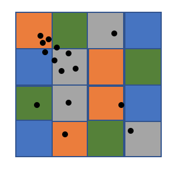 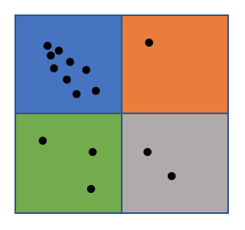


#### Technique 2. cell graph 
Split space into cells whose diagonal is eps, we can use three lemmas which greatly accelerate the algorithm:

Lemma 1: If there is a core point in the cell, all points in the cell belong to the same cluster. (As shown in the left most graph below, all points in C1 are in the same cluster.)

Lemma 2: If cell 1 and cell 2 are core cells (there is a core point in the cell), and one core point p in cell 1 has a neighbor in cell 2, then all points in cell 1 and cell 2 belong to the same cluster. (As shown in the middle graph below) 

Lemma 3: If cell 1 is a core cell, cell 2 is a non-core cell, and one core point p in cell 1 has a neighbor q in cell 2, then q belongs to the same cluster as cell 1. (As shown in the right graph below)

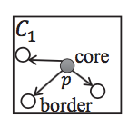 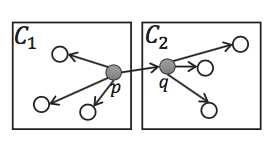 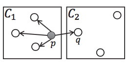

Having these three lemmas at hand we can confidently build a graph whose nodes are the entire cells instead of individually points.
#### Step 1. Work partitioning 
Partitioning the space into cells whose diagonal is eps and assign points to its cell. This process is similarly to the data parallel part introduced above. Cells are split into n partitions randomly and n is the number of workers in MPI.
#### Step 2. Partial graph construction
In this stage, we mark cells and points in the partition as core/non-core and construct a cell graph as shown in the pseudocode below. We keep using the compact adjacency list to represent our graph.
```
for each cell in the partition:
    for each point in the cell:
        neighbors = findNeighbors(point)
        if neighbors.size >= minPts:
            mark point as core
    if there is a core point in the cell:
        mark the cell as core cell
        for each neighborCell
            add an edge to graph from cell to neighborCell
```
#### Step 3. Graph merging and point labelling
Now each worker has a partial graph at hand, we use a two-level shallow tree to gradually combine them into a full cell graph. Basically, worker with odd id pass its graph to its previous worker, worker with even id combines two graph and pass to master, master is responsible for generating a global cell graph. 

Point labelling is for core cells is straightforward according to Lemma 1 and 2, we use BFS to two find connected cells and they belong to the same clusters. 
Point labelling for non-core cell is indirect which requires considering points one by one as shown in the pseudocode below. (With Lemma 3)
```
for each non-core cell:
    for each point in the cell:
        neighbors = findNeighbors(points)
        for neighbor in neighbors:
            if neighbor is a core point:
                label point the same as its neighbor
                break
```

## Results

### CUDA version Speedup
For comparison, we use `sklearn.cluster.DBSCAN`, which is implemented in Cython and accelerated using `k-D tree` by default, and by specifying `n_jobs=-1`, we could utilize all processors. We also implmented a sequential version in `c++` as another baseline. 

We adapt the more classis test cases from [RP-DBSCAN], but also invent some test cases ourselves to really push the limit as all classic test cases only have 100,000 points.

| test case\scanner type    | sklearn.cluster.DBSCAN | seq | G-DBSCAN | G-DBSCAN Data Parallel |
|---------------------------|------------------------|-----|----------|------------------------|
| moon(eps=0.01, N=5)       | KILLED                 | *   | 366.3ms  | 188.6ms                | 
| chameleon(eps=0.05, N=3)  | KILLED                 | *   | 623ms    | 238ms                  | 
| blobs(eps=0.01, N=10)     | KILLED                 | *   | 654ms    | 220ms                  |

We see that `sklearn.cluster.DBSCAN` got killed here (although we didn't find a specific reason for it), the sequential $O(n^2)$ version is simply taking too long and we never expect it to finish. We notice that `G-DBSCAN Data Parallel` consistently performs better. However, we should also note that hyper-parameters here are very important as suppose we are given a huge $\epsilon$ then basically all points will be connected and there will only be a single cluster. In this case we would have very few cells and it won't help.  The plots also show that the result is sensitive to hyper-parameters. We expected a better result for chameleon but aren't able to get hyper-parameters correct.
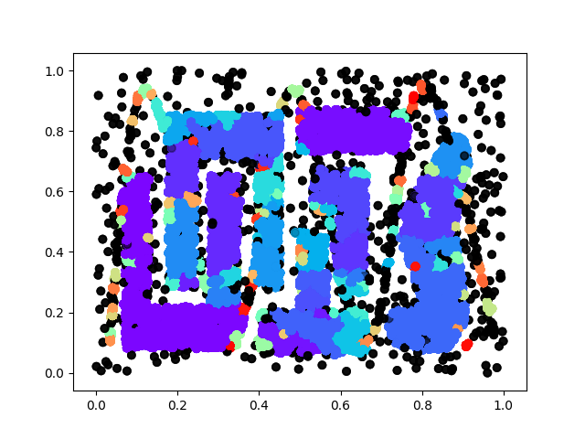
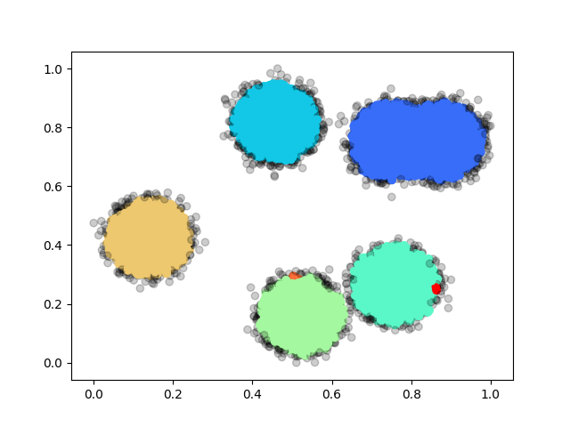


We also come up with some test cases our own: random and rings, basically the former one is sampled from uniform distribution and the latter one is sampled from a ring with gaussian noise. We have 3 different sizes: `1000`, `10,000` and `100,000` for each case. We summarize the performance below:

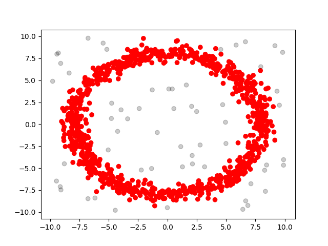
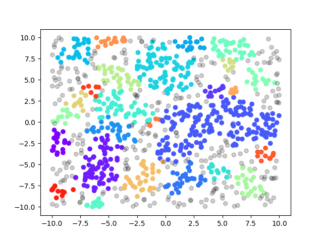

| test case\scanner type  | G-DBSCAN Data Parallel(ms) | sklearn.cluster.DBSCAN(ms) | seq(ms)  |
|-------------------------|----------------------------|----------------------------|----------|
| rings-1000              | 147.05                     | 6.46                       | 5.91     |
| rings-10000             | 98.07                      | 175.02                     | 262.81   |
| rings-100000            | 349.97                     | 5928.06                    | 19081.30 |
| random-1000             | 144.36                     | 5.28                       | 2.88     |
| random-10000            | 112.55                     | 118.40                     | 211.66   |
| random-100000           | 182.39                     | 3645.03                    | 16317.20 |
 
### MPI version load balancing and breakdown of time
We did not include the MPI verison in the above comparison, since the speedup of MPI on one machine did not outperform the CUDA version. But there are serveral things deserve to be highlighted:

With random partioning technique, each worker is relatively assigned the same amount of work as we can see from the graph below, which is the time to construct partial cell graph.
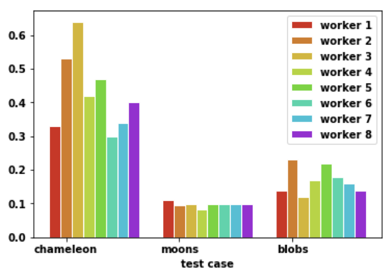

With cell graph, we can see labelling process is pretty fast in the blue part below. Partial graph construction can be further improved by using CUDA on each machine. Merge graph can be further improved by tree like merge instead of master as a single point. Work partition part is the most consuming one while it has great benefit for later stages.
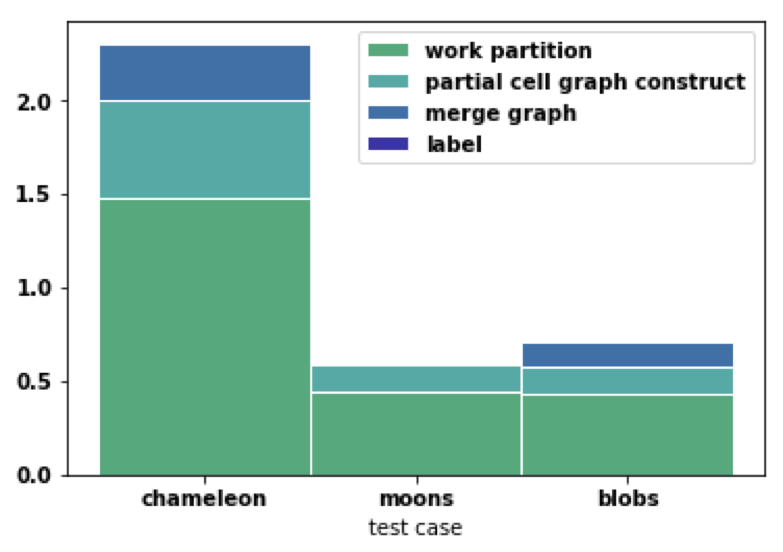


## Work Distribution
Yueni Liu and Sailun Xu contribute equally in this project on all parts.

## References

[dbscan]: https://www.aaai.org/Papers/KDD/1996/KDD96-037.pdf

\[1\] Ester, M., Kriegel, H.P., Sander, J. and Xu, X., 1996, August. A density-based algorithm for discovering clusters in large spatial databases with noise. In Kdd (Vol. 96, No. 34, pp. 226-231).

[G-DBSCAN]: https://www.sciencedirect.com/science/article/pii/S1877050913003438
\[2\] Andrade, G., Ramos, G., Madeira, D., Sachetto, R., Ferreira, R. and Rocha, L., 2013. G-dbscan: A gpu accelerated algorithm for density-based clustering. Procedia Computer Science, 18, pp.369-378.

[PDS-DBSCAN]: https://ieeexplore.ieee.org/document/6468492
\[3\] Patwary, M.A., Palsetia, D., Agrawal, A., Liao, W.K., Manne, F. and Choudhary, A., 2012, November. A new scalable parallel DBSCAN algorithm using the disjoint-set data structure. In Proceedings of the International Conference on High Performance Computing, Networking, Storage and Analysis (p. 62). IEEE Computer Society Press.

[MR-DBSCAN]: https://ieeexplore.ieee.org/document/6121313
\[4\] He, Y., Tan, H., Luo, W., Mao, H., Ma, D., Feng, S. and Fan, J., 2011, December. Mr-dbscan: an efficient parallel density-based clustering algorithm using mapreduce. In 2011 IEEE 17th International Conference on Parallel and Distributed Systems (pp. 473-480). IEEE.

[NG-DBSCAN]: http://www.vldb.org/pvldb/vol10/p157-lulli.pdf
\[5\] Lulli, A., Dell'Amico, M., Michiardi, P. and Ricci, L., 2016. NG-DBSCAN: scalable density-based clustering for arbitrary data. Proceedings of the VLDB Endowment, 10(3), pp.157-168.

[RP-DBSCAN]: https://dm.kaist.ac.kr/lab/papers/sigmod18.pdf
\[6\]Song, H. and Lee, J.G., 2018, May. RP-DBSCAN: A superfast parallel DBSCAN algorithm based on random partitioning. In Proceedings of the 2018 International Conference on Management of Data (pp. 1173-1187). ACM.
